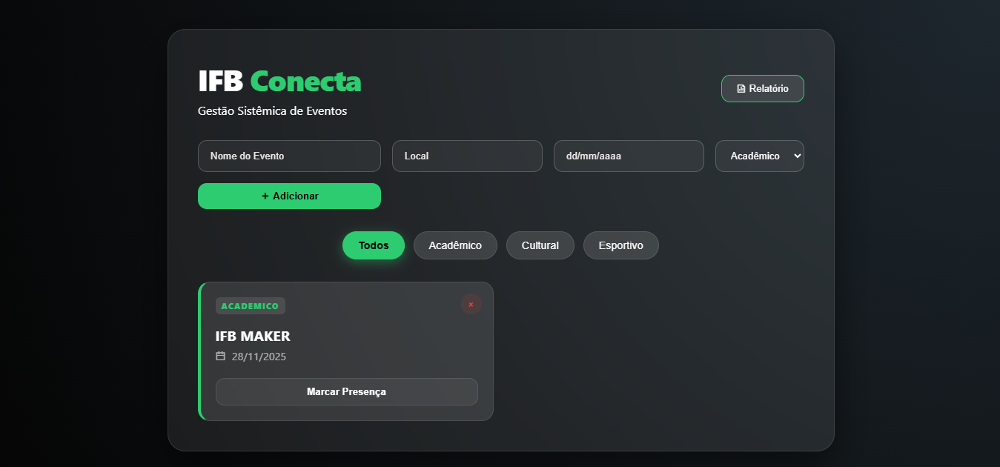

# SGE-IFB  
## Sistema de Gestão de Eventos Acadêmicos

O **SGE-IFB** é uma plataforma desenvolvida em **Python** para a organização centralizada do calendário institucional do **Instituto Federal de Brasília (IFB)**.  
O sistema otimiza o fluxo de eventos acadêmicos, permitindo o controle de cronogramas, categorização estratégica, monitoramento de participação e extração de métricas de desempenho organizacional por meio de relatórios integrados.

---

## 🚀 Funcionalidades

- **Painel Administrativo**  
  Interface moderna baseada em Glassmorphism para gestão de eventos.

- **Filtros Inteligentes**  
  Ordenação e filtragem por categorias:
  - Acadêmico  
  - Cultural  
  - Esportivo  

- **Validação Flexível**  
  Suporte a múltiplos formatos de data (com ou sem barras).

- **Relatórios em Tempo Real**  
  Métricas de participação e totalização por categoria.

- **Controle de Presença**  
  Sistema de check-in para eventos planejados.

---

## 🛠️ Tecnologias Utilizadas

- **Backend:** Python, Flask  
- **Frontend:** HTML5, CSS3 (Custom Properties e Glassmorphism), JavaScript (Vanilla ES6)  
- **Ícones:** Remix Icon  

---

## 📋 Passo a Passo para Execução

As instruções abaixo descrevem como executar o projeto localmente no **Windows**, utilizando o **PowerShell**.

### 1. Pré-requisitos

Verifique se o Python está instalado:

```powershell
python --version



